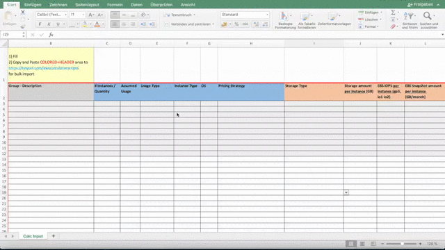

# aws-pricing-calculator-scripts

[](https://travis-ci.com/frumania/aws-pricing-calculator-scripts-test)

## Step by Step Guide

### Importer

1. Download one of the excel sheets

2. Fill in your data. Value Helps should show you all supported configurations. You can either specify EC2, Storage or both!

- EC2
- EC2 Dedicated Hosts (*.metal)
- EBS
- S3 / S3 IA
- EFS
- FSX for Windows

<br/>

| Column | Description | Example |
| :-------------- | :--------- | :--------- |
| Group - Description | Builds the hierarchy and adds a service description | Production - Database|
| # Instances / Quantity | Amount of instances or volumes | 1 |
| Assumed Usage | Scheduled only (Hours per Week) | 40 |
| Usage Type | Always On or Scheduled | Always On |
| Instance Type | EC2 Instance (*.metal for Dedicated Hosts) | m5.large / u-6tb1.metal|
| OS | As per Value Help | Linux |
| Pricing Strategy | As per Value Help | 3 Yr All Upfront Reserved |
| Storage Type | As per Value Help | General Purpose SSD (gp2) |
| Storage amount per Instance | In GB | 100 |
| EBS IOPS per Instance | EBS gp3, io1 io2 only | 5000 |
| EBS Snapshot amount per Instance | EBS only, in GB/month | 500 |
| EBS Throughput per Instance (Optional) | EBS gp3 only, in MB/s | 250 |
| AWS Region (Optional) | In case a single service should be provided from another region (e.g. DR) | eu-central-1 |

<br/>

**Note:** Regardless of if you specify storage for an instance directly, the calulation is always split between EC2 and storage to highlight individual costs.

[](preview.mp4)

### Exporter

Add an existing pricing calculator link to fetch the data.

<br/>

**Note:** You can also use the native export feature of the pricing calculator.

## Run automated test

```bash
protractor conf.js
```